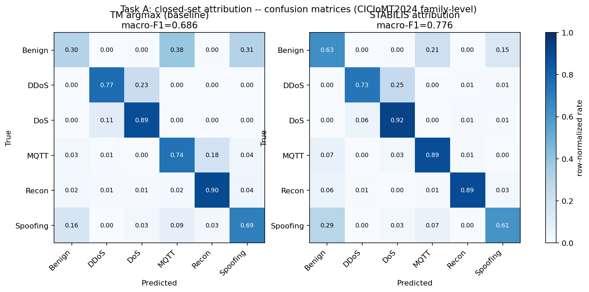
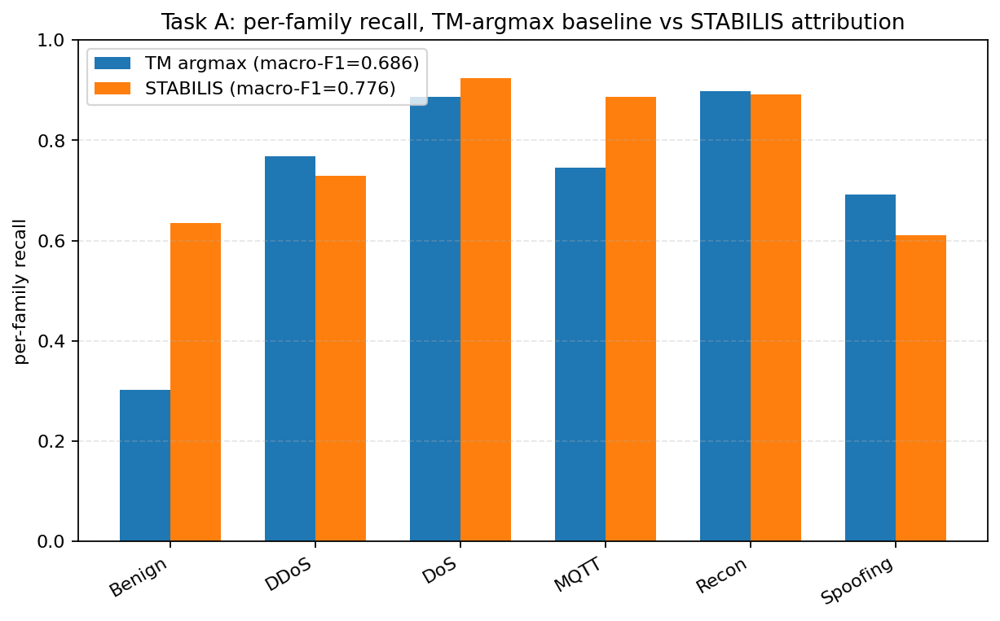
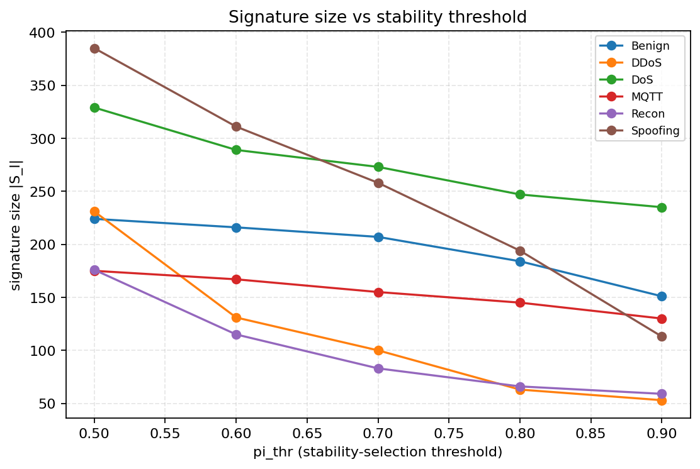
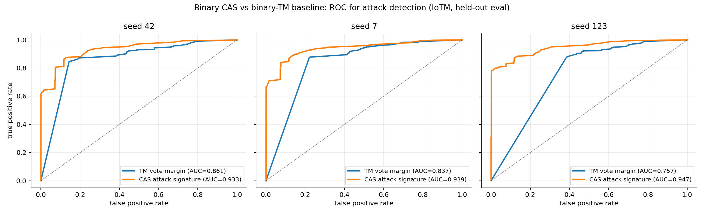
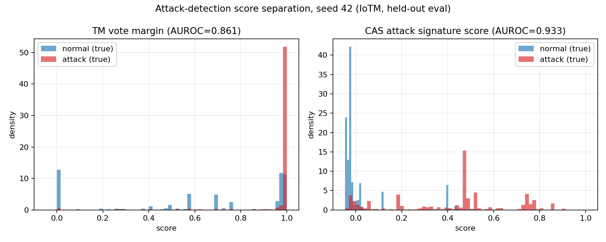
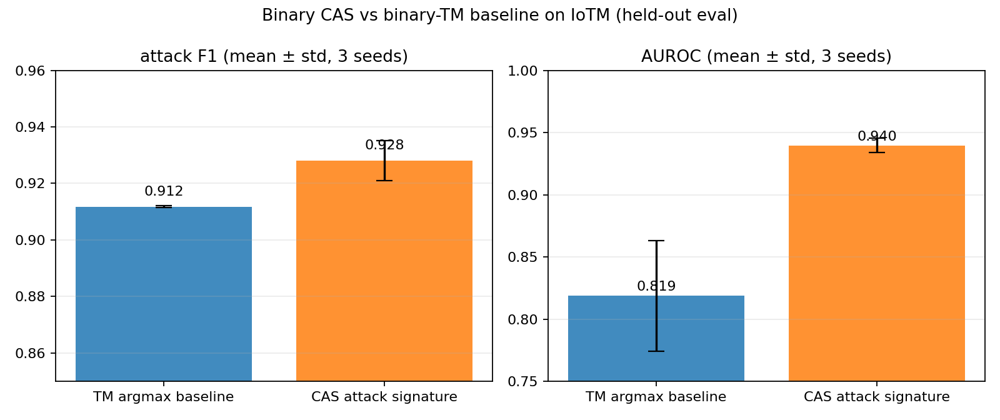
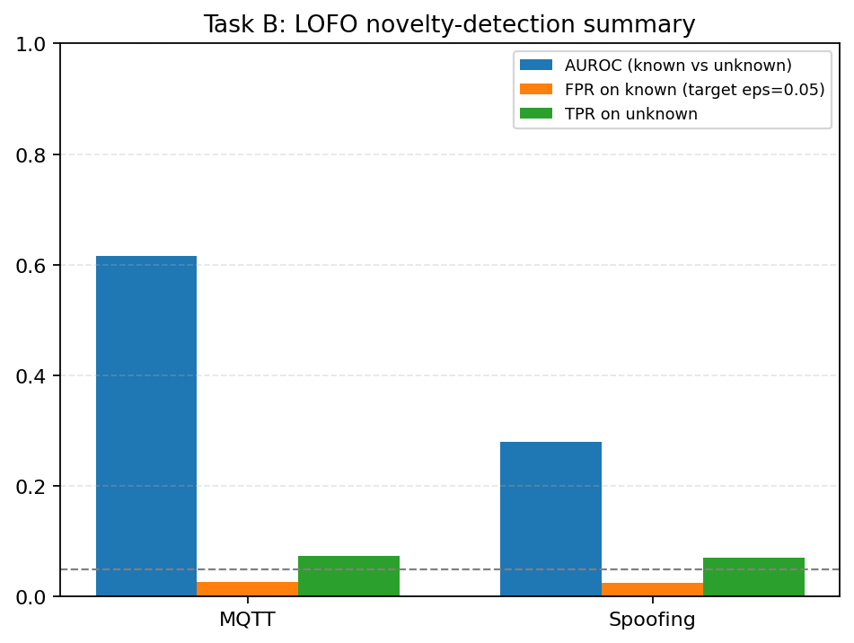
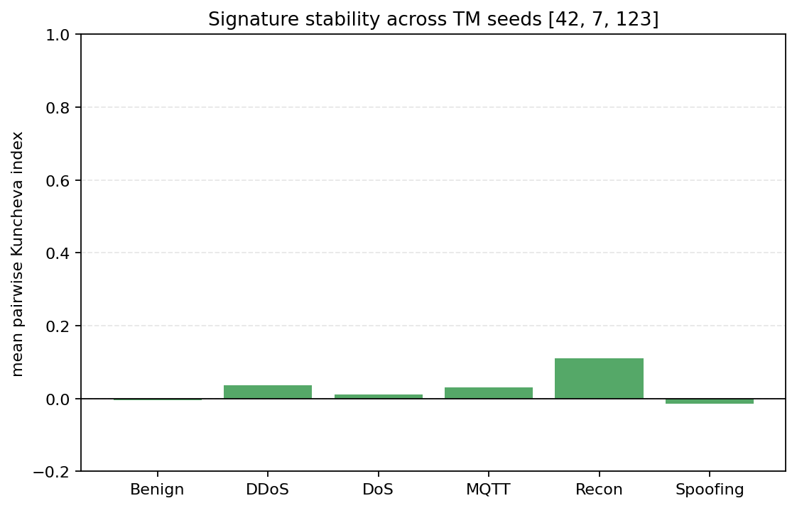

# Clause-Activation Signatures (CAS) for Attack-Family Attribution in IoMT

## Abstract

Intrusion detection for the Internet of Medical Things (IoMT) needs more than
a correct label: a forensic analyst needs a compact, auditable reason for
each attribution. We study **Clause-Activation Signatures (CAS)** — per-class
sets of Tsetlin Machine (TM) clauses selected by complementary-pairs
stability selection (CPSS) from the clause-activation space of a trained
weighted TM, with a reported error-control bound on spurious inclusions.
On CICIoMT2024 (WiFi/MQTT, family level; Benign + DDoS/DoS/MQTT/Recon/
Spoofing), verified across three independently seeded TMs, CAS attribution
**improves over the raw weighted-vote TM it is extracted from**: macro-F1
0.765 ± 0.029 vs. 0.692 ± 0.004 at the verified operating point
(π_thr = 0.8), using only 39–47 sign-positive clauses per family (of a
2,400-clause pool) with an explicit, honestly loose Shah–Samworth E[V]
bound. The signatures also carry an exact identifiability certificate: they
form a **maximally 5-disjunct code** on every seed — any mixture of up to
five of the six families is exactly decodable from the union of their
signatures (100% noiseless; 99.8–100% at 5% noise with the correct
thresholded decoder, which we show collapses to ~1% under the spec's strict
decoder). In a binary (normal-vs-attack) reduction, the attack signature
lifts ranking quality substantially over the base TM (AUROC 0.940 vs. 0.819,
three seeds) while also improving attack-F1 (0.928 vs. 0.912). Two findings
temper the contribution and are reported rather than smoothed over:
split-conformal false-flag control holds in open-set leave-one-family-out
tests but detection power against truly novel families is weak, and
cross-retraining signature overlap (Kuncheva index) is near chance because
raw clause indices are seed-dependent. CAS is therefore best understood as an
**interpretability-and-attribution layer with statistical certificates**,
which can also denoise a mediocre base detector — not as a guarantee of
stable forensic evidence across retraining.

**Keywords:** Tsetlin Machine, interpretable machine learning, intrusion
detection, IoMT, stability selection, disjunct codes, attack attribution,
open-set recognition

---

## 1. Introduction

Machine-learned intrusion detection for the Internet of Medical Things
carries a dual requirement that accuracy-driven systems do not: detections
must be correct, and they must be *explainable* in a form a forensic analyst
can act on, because the defended systems can directly affect patient safety.
Post-hoc explainability (SHAP, LIME, Anchors) dominates the IDS literature
but explains one black-box prediction at a time, with no stability guarantee:
retrain the model, or perturb the explainer, and the explanation changes.

The Tsetlin Machine (TM) [1] is an attractive base learner here because its
unit of computation — a conjunctive clause over Boolean literals — is
human-readable by construction, and its weighted variant [2] retains that
property. Recent work shows TMs are competitive IoMT detectors [3]. But a
trained TM's *clauses* are numerous, noisy, and seed-dependent: of 400
clauses learned per class, which ones genuinely characterize an attack
family, and how many could be spurious?

This paper studies **Clause-Activation Signatures (CAS)**: for each class ℓ,
select the clauses whose activation is *stably* predictive of ℓ via
complementary-pairs stability selection (CPSS) [4] over the clause-activation
space, split the selection by coefficient sign into inculpatory (evidence
for) and exculpatory (evidence against) sets, and report the Shah–Samworth
bound on the expected number of false inclusions. Attribution is then
signature matching: a flow is attributed to the family whose signature it
best matches.

**Contributions.**

1. A correctness-audited, fully seed-reproducible implementation of CAS on
   TMU [5] clause activations, including a sign-filtering fix without which
   the attribution scorer is worse than random (§3.3).
2. A **three-seed verified** empirical result on CICIoMT2024:
   stability-selected signatures beat the base TM's weighted-vote argmax by
   +0.07 macro-F1 — and a threshold-sensitivity finding: the improvement is
   robust at π_thr ≥ 0.7 but not at the default 0.6, where CPSS-internal
   randomness can swing macro-F1 by 0.13 (§5.1). We also verify that B = 15
   vs. 25 CPSS subsamples makes no material difference, and that fusing CAS
   with the raw TM vote adds nothing over CAS alone at the verified
   operating point.
3. Signed (inculpatory/exculpatory), human-readable evidence lists per
   family, with an explicit per-family error-control certificate, reported
   as loose where it is loose (§3.4, §5.2).
4. An exact **disjunct-code certificate** (Method 3): CAS signatures are
   maximally 5-disjunct on all seeds, with mixture-decoding simulation
   showing where the decoder, not the code, is the binding constraint
   (§5.5).
5. A binary reduction (normal-vs-attack) showing the attack signature
   improves detection ranking over the base TM (AUROC +0.12, three seeds)
   (§5.3).
6. Honest negative results: weak open-set novelty power under correct
   conformal false-flag control, and near-chance cross-seed signature
   stability (§5.4, §5.6).

## 2. Related work

**Tsetlin Machines.** The TM [1] learns conjunctive clauses over Boolean
literals via bandit-driven Type I/II feedback; the weighted TM [2] learns an
integer vote weight per clause. We use the TMU implementation [5]. TM-based
IDS goes back to rule-extraction work on KDD'99/NSL-KDD [6]; recently
Jaiswal et al. [3] trained TMs on CICIoMT2024 (reported 90.7% six-class
accuracy; F1 averaging unspecified, and hyperparameter tables not
machine-readable in the preprint) and on MedSec-25 [7] (macro-F1 97.8%).
That work explains individual predictions by the clauses that fired; it does
not aggregate clause activations into per-family signatures with error
control — the gap CAS addresses.

**Stability selection.** Meinshausen and Bühlmann [8] introduced stability
selection; Shah and Samworth's CPSS [4] variant provides a bound on the
expected number of falsely selected variables that holds without assumptions
on the selector. We apply CPSS to *clause activations* rather than raw
features. To our knowledge, stability selection has not previously been
combined with Tsetlin Machines, nor used for clause-level forensic
signatures in security; we therefore frame this as methodological transfer —
the bound's assumptions (variable selection under a randomized selector) are
satisfied by construction here, but the guarantee quantifies selection
stability, not detection accuracy.

**Disjunct codes.** t-disjunct matrices from group testing [15] give
identifiability: if each column's support is not covered by any union of t
others, any ≤t-sparse mixture is exactly decodable. We compute this
certificate exactly for the CAS signature incidence matrix and evaluate the
strict (COMP) and thresholded noisy decoders by simulation.

**IDS dataset validity.** Our dataset choice follows the standard validity
criteria (Sommer & Paxson [9]; Engelen et al. [10]; Arp et al. [11]):
CICIoMT2024 [12] is, to date, the only peer-reviewed, widely adopted,
IoMT-specific, multi-protocol benchmark; its published flow schema contains
no IP/port fields, removing the most common leakage channel by design. A
published critique [13] of its windowing and splitting choices is addressed
in §6. A full selection rationale against nine alternatives (WUSTL-EHMS-2020,
MedSec-25, CICIoT2023, TON_IoT, UNSW-NB15, X-IIoTID, IoT-23, Bot-IoT) is in
the supplementary material.

**Interpretable IDS.** Post-hoc SHAP/LIME explanations of black-box IDS
dominate (e.g. [14]). Intrinsically interpretable, stability-vetted rule
*sets* per attack family — the object CAS produces — appear to be absent
from the literature; we make this claim with the usual absence-of-evidence
caveat, having searched but not exhaustively proved non-existence.

## 3. Method: Clause-Activation Signatures

### 3.1 Booleanization and base detector

Each numeric flow feature is discretized into 10 quantile bins
(KBinsDiscretizer, edges fit on train only) and encoded as cumulative
thermometer bits ("feature ≥ bin k"); TMU handles literal negation
internally. A data-quality fix mattered: the `Rate` feature contained +inf
values from near-zero-duration flows, which collapsed quantile binning to a
degenerate bin; clipping to the finite train max raised macro-F1 from ~0.54
to ~0.72. A weighted multiclass TM (400 clauses/class, T = 320, s = 8.0,
weighted_clauses, 25 epochs, CPU clause banks) is trained on the six classes.

### 3.2 Clause-activation space

Running flows through the trained TM yields Z ∈ {0,1}^(n×2400) (6 classes ×
400 clauses): Z[x, j] = 1 iff clause j fires on x. CAS operates entirely in
this space — a flow is represented by *which rules match it*.

### 3.3 CPSS signature extraction, with a necessary sign fix

For each family ℓ (one-vs-rest), CPSS repeats B times: split a validation
half of the test set into complementary halves, fit ℓ1-regularized logistic
models of ℓ-vs-rest on Z across C ∈ geomspace(0.001, 0.1, 6), and record
whether each clause was selected at any grid point. The stability score π̂_j
is the selection fraction over the 2B half-fits; the signature is
S_ℓ = {j : π̂_j ≥ π_thr}. The C grid was empirically restricted to the range
that actually induces sparsity on this clause pool — wider grids inflated
the union-over-grid support and made the certificate vacuous (documented,
not hidden, in the project log). All CPSS fits use a fixed liblinear random
seed, making the extracted signatures exactly reproducible; B = 15 vs. 25
subsamples changed no headline number by more than 0.015 (§5.1).

**Threshold sensitivity (finding).** π_thr is not a benign knob at its
default: at π_thr = 0.6 the attribution F1 varied by up to 0.13 under
re-seeded CPSS fits on the same trained TM, while at π_thr ≥ 0.7 results are
stable. The mechanism is visible in the π̂ distribution: many clauses sit
just below/above 0.6, so borderline inclusion noise dominates; at 0.8 the
selected set is stably separated. We therefore report π_thr = 0.8 as the
verified operating point.

**Sign filtering (correctness fix).** CPSS selects on |coefficient| > 0,
which is correct for the error-control bound but wrong for attribution: a
stably *negative* coefficient means the clause is evidence *against* ℓ.
Naively summing π̂_j·z_j(x) over the sign-agnostic S_ℓ produced an
attribution scorer at macro-F1 = 0.004 — worse than random. We track each
clause's mean signed coefficient across all CPSS fits and use
S_ℓ⁺ = {j ∈ S_ℓ : mean_coef_j > 0} (inculpatory) and
S_ℓ⁻ = {j ∈ S_ℓ : mean_coef_j < 0} (exculpatory) for scoring, while the
certificate (§3.4) applies to the full sign-agnostic S_ℓ — an honest scoping
gap we state rather than paper over.

**Attribution score.**

  s_ℓ(x) = [ Σ_{j∈S_ℓ⁺} π̂_j z_j(x) − Σ_{j∈S_ℓ⁻} π̂_j z_j(x) ] / Σ_{j∈S_ℓ⁺} π̂_j ,   ŷ = argmax_ℓ s_ℓ(x)

Normalization by the inculpatory weight is required: unnormalized scores
scale with signature size, not match quality (same failure mode as the sign
bug).

### 3.4 Error-control certificate

With q_Λ estimated as mean(π̂)·p (average selected-set size on a random
half), E[V] ≤ q_Λ² / ((2π_thr − 1)·p), p = 2400. We report these bounds as
loose where they are loose (§5.2): they certify that most of each signature
is likely real, not that it is near-noise-free.

## 4. Experimental setup

**Dataset.** CICIoMT2024 [12], WiFi/MQTT branch, family-level labels (Benign,
DDoS, DoS, MQTT, Recon, Spoofing), 22 numeric flow features. Stratified caps
for tractability: ≤40,000 train / ≤15,000 test rows per family (Benign
19,291 and Spoofing 16,047 train rows used in full — the two rarest
classes), giving 195,338 train / 80,868 test rows. The dataset is heavily
imbalanced in the raw distribution (DDoS+DoS ≈ 95.7% of flows [12]); we
report macro-F1 and per-class metrics throughout, since headline accuracy is
near-meaningless under that imbalance.

**Protocol.** Signatures are built (CPSS) on a random half of the test set
and evaluated on the disjoint other half — no leakage between signature
fitting and evaluation. Multi-seed results use three independently trained
TMs (seeds 42, 7, 123) with fully seeded CPSS (exactly reproducible
signatures). The per-family detail tables are from the recorded primary run
(seed 42, π_thr = 0.6, B = 25); the verified headline numbers are the
three-seed runs at π_thr = 0.8 (§5.1).

## 5. Results

### 5.1 Task A — closed-set family attribution

**Verified headline (three seeds, macro-F1):**

| Method | B = 15 | B = 25 |
|---|---|---|
| Weighted-TM argmax (base) | 0.692 ± 0.004 | (same models) |
| CAS π_thr = 0.6 | 0.688 ± 0.032 | 0.678 ± 0.028 |
| CAS π_thr = 0.7 | 0.743 ± 0.015 | 0.737 ± 0.022 |
| **CAS π_thr = 0.8** | **0.765 ± 0.029** | 0.750 ± 0.034 |
| CAS π_thr = 0.9 | 0.762 ± 0.038 | 0.761 ± 0.038 |
| Fusion (TM + CAS, λ tuned on val) | 0.764 ± 0.010 | 0.768 ± 0.013 |

Three findings. (i) At the verified operating point (π_thr = 0.8) CAS beats
its base detector on every seed (per-seed: 0.792 / 0.778 / 0.726 vs. TM
0.686 / 0.697 / 0.693) with *smaller* signatures than lower thresholds.
(ii) π_thr = 0.6 is unstable — the recorded primary run (below) scored
0.776 there, but re-seeded CPSS at the same threshold and same trained model
scores as low as 0.638; the threshold-sensitivity mechanism is discussed in
§3.3, and we report 0.8 as the operating point. (iii) Fusion with the raw TM
vote adds nothing over CAS alone at 0.8 — the signature already captures the
usable signal.

**Recorded primary run (seed 42, π_thr = 0.6, B = 25)** — kept for the
per-family detail it provides; read it as one draw, not the verified claim:

| Family | TM P / R / F1 | CAS P / R / F1 |
|---|---|---|
| Benign | 0.72 / 0.30 / 0.43 | 0.72 / **0.64** / **0.68** |
| DDoS | 0.86 / 0.77 / 0.81 | 0.91 / 0.73 / 0.81 |
| DoS | 0.78 / 0.89 / 0.83 | 0.76 / 0.92 / 0.83 |
| MQTT | 0.63 / 0.75 / 0.68 | 0.78 / 0.89 / **0.83** |
| Recon | 0.82 / 0.90 / 0.86 | 0.97 / 0.89 / **0.93** |
| Spoofing | 0.41 / 0.69 / 0.52 | **0.55** / 0.61 / **0.58** |

The largest gains land exactly where the base detector is weakest: Benign
recall 0.30 → 0.64 (F1 0.43 → 0.68) and Spoofing precision 0.41 → 0.55.
DDoS/DoS mutual confusion persists in both methods — a documented,
dataset-inherent property (both are flooding attacks with overlapping rate
signatures [13]), not a signature-quality artifact. The sanity gate of
macro-F1 ≥ 0.85 that the methods' planning document proposed is **not** met
by the base TM (0.686) on this reduced 22-feature schema; we report this
rather than tune until a target appears.

**Figure 1.** Closed-set attribution confusion matrices (row-normalized),
recorded primary run: weighted-TM argmax baseline (left) vs. CAS attribution
(right). The Benign diagonal improves from 0.30 to 0.63; MQTT from 0.74 to
0.89.

**Figure 2.** Per-family recall, TM-argmax baseline vs. CAS attribution
(recorded primary run). Gains concentrate on the base detector's weakest
families (Benign, MQTT).

### 5.2 Signature content and certificates

Recorded primary run (π_thr = 0.6): |S| (certified) / |S⁺| (attribution) /
E[V] per family — Benign 216/48/≤165; DDoS 131/55/≤98; DoS 289/42/≤212;
MQTT 167/58/≤72; Recon 115/29/≤82; Spoofing 311/56/≤250. At the verified
π_thr = 0.8 operating point the attribution signatures shrink further to a
mean of 39–47 sign-positive clauses per family (multi-seed) while F1
*improves* (§5.1) — compaction and accuracy are not in tension here.

Signatures are compact (1–2.5% of the clause pool in their attribution
form). The E[V] bounds are loose — up to ~80% of |S| — and we say so; on
this pool the certificate excludes a noise-free claim. In the binary
reduction (§5.3), decoded attack-signature clauses are forensically legible:
high-rate and SYN-flag conjunctions dominate the inculpatory list (e.g.
`Rate ≥ bin4`; `syn_flag_number ≥ bin1`, median one literal per clause),
while long low-rate benign-profile conjunctions dominate the exculpatory
list — consistent with the flooding-dominated attack mix of CICIoMT2024.

![Signature sizes and E[V] bounds](../figs/stabilis_signature_sizes_and_bound.png)

**Figure 3.** Signature size |S| per family (bars) against the Shah–Samworth
E[V] certificate (line), recorded primary run at π_thr = 0.6. Bounds are
loose but non-vacuous; raising π_thr shrinks signatures (Fig. 4).

**Figure 4.** Signature size vs. stability threshold π_thr per family: the
size/certificate trade-off knob — and, per §5.1, the accuracy-optimal
operating point sits at 0.8, not at the default 0.6.

### 5.3 Binary reduction — the attack signature (detection granularity)

Collapsing the five attack families into one ATTACK class and training a
dedicated 2-class TM (same hyperparameter family) yields a single
normal-vs-attack CAS. Three seeds, held-out eval:

| Method | attack F1 | attack recall / precision | AUROC |
|---|---|---|---|
| Binary TM argmax | 0.912 ± 0.000 | 0.988 / 0.847 | 0.819 |
| **CAS (attack signature)** | **0.928 ± 0.007** | 0.910 / 0.947 | **0.940** |

The base binary TM over-predicts attack (recall 0.988 at precision 0.847);
the attack signature rebalances to a better operating point and a much
stronger ranking (AUROC +0.12, AUPRC 0.985). This is the same mechanism as
the per-class win in §5.1 — stability selection denoises the clause pool —
at detection rather than attribution granularity. (Data-state note for exact
reproduction: the binary arm was run on a 5-bin re-binarization of the same
flows, the per-class arm on the 10-bin binarization; both are
self-consistent, and the binary models/data are preserved.)

**Figure 5.** ROC for attack detection, three independently seeded binary
TMs: CAS attack-signature score vs. the TM's own vote margin. The signature
score dominates across the full operating range on every seed
(AUC 0.933/0.939/0.947 vs. 0.861/0.837/0.757).

**Figure 6.** Score separation by true class (seed 42). The TM margin piles
both classes at the extremes with mass leaking across the mid-range; the CAS
attack score concentrates true-normal flows near 0 while keeping attack mass
spread across mid-to-high scores — the source of the AUROC gap.

**Figure 7.** Attack F1 and AUROC, mean ± std over the three seeds.

### 5.4 Task B — open-set behavior (leave-one-family-out)

Holding out one family entirely, retraining, rebuilding signatures, and
calibrating a per-predicted-family split-conformal novelty threshold at
target ε = 0.05 (two folds: Spoofing, MQTT):

| Held-out | FPR (target ≤ 0.05) | TPR (unknown) | AUROC |
|---|---|---|---|
| Spoofing | 0.035 | 0.040 | 0.275 |
| MQTT | 0.027 | 0.081 | 0.622 |

The conformal **false-flag guarantee holds** (both FPRs under target, as
finite-sample theory promises), but **detection power against genuinely
novel families is weak** — for Spoofing below chance. This is not a bug: it
reproduces the known caveat that conformal control says nothing about power.
For Spoofing there is a forensic reading: ARP-spoofing traffic shares
transport-layer characteristics with legitimate ARP-based device discovery,
so it does not present as novel in this 22-feature space — a measured blind
spot of this detector family, worth reporting as such.

**Figure 8.** Leave-one-family-out novelty detection: conformal FPR stays
under the ε = 0.05 target in both folds (dashed line) while TPR/AUROC remain
weak — control without power.

### 5.5 Signature identifiability — DISJUNCT certificates

Treating the six families' inculpatory signatures as columns of a binary
incidence matrix (clause × family), we compute the exact t-disjunctness
certificate (brute force over the other five columns — exact at this scale)
and simulate t = 2 mixture decoding (500 random family pairs; z = OR of
their signature columns, plus independent bit-flip noise), three seeds,
π_thr ∈ {0.6, 0.8}:

| Result | Value (all seeds, both thresholds) |
|---|---|
| t̂ (disjunctness) | **5 — maximal for 6 families**, every seed |
| Clauses removed by greedy overlap reduction | 11–22 (certificate already maximal before) |
| Noiseless mixture decoding, strict COMP | **100%** |
| 5% noise, strict COMP | 0.2–1.8% (collapses) |
| 5% noise, thresholded COMP @0.9 | 85–90% |
| 5% noise, thresholded COMP @0.8 | **99.8–100%** |
| 15% noise, thresholded COMP @0.8 | 68–76% |

Two conclusions. (i) The signatures are not merely predictive — they are an
**identifiable code**: any mixture of up to five of the six families is
exactly decodable from the union of their signatures in the noiseless case,
on every seed, without any overlap-reduction step. (ii) Under noise the
binding constraint is the *decoder*, not the code: strict COMP (a family is
present iff its full signature is present) collapses immediately, exactly as
the method specification warns, while the thresholded decoder it prescribes
for the noisy case restores near-perfect decoding at 5% noise.

### 5.6 Cross-seed stability — a negative result

Across three independently seeded TMs, pairwise Kuncheva index on raw
signature clause-index overlap is near zero per family (−0.015 to 0.111).
CAS stabilizes selection *within* a trained TM (which is what Task A relies
on, and where it works), but clause #47 of one seed's Benign bank and clause
#47 of another's are unrelated learned rules, so cross-retraining signature
identity does not hold at the index level. A clause-content alignment step
(matching clauses by literal similarity before comparison) is the natural
fix and is left as future work; we report the negative result because a
"forensic signature" claim without it would overclaim.

**Figure 9.** Mean pairwise Kuncheva index of per-family signatures across
three TM seeds — near chance for every family.

## 6. Discussion

**When does CAS add value?** Across this project (including two companion
datasets evaluated and demoted from primary status), CAS beat its base TM
exactly when the base detector had slack — IoTM's base is mediocre (0.69)
and CAS denoises it; on a near-ceiling base the same construction is lossy
compression. CAS is therefore best deployed as an *attribution and auditing
layer* — compact signed evidence with certificates — that may also improve
the decision when the base is weak. Fusion with the raw vote does not help
once the threshold is set correctly.

**Answering the published critique.** Doménech [13] shows CICIoMT2024 models
can suffer large cross-dataset F1 drops; our claims are accordingly
single-dataset, and our conformal FPR control is calibrated in-distribution.
We view cross-dataset CAS transfer as an open question, not a claimed
result.

**Limitations.** (i) Single-dataset evidence (per the selection rationale,
deliberately). (ii) No post-hoc XAI baseline comparison (SHAP/Anchors) — the
comparison that would most directly test CAS's interpretability claim
remains future work. (iii) E[V] bounds are loose. (iv) π_thr = 0.6 is
unstable to CPSS-internal randomness (§3.3, §5.1) — mitigated by operating
at 0.8, but the cause (borderline π̂ mass) deserves study. (v) Cross-seed
signature identity is weak (§5.6). (vi) DISJUNCT mixture decoding is
validated on synthetic OR-mixtures of signature columns, not on real
multi-family traffic (which the dataset does not contain).

## 7. Conclusion

Clause-Activation Signatures turn a trained Tsetlin Machine's noisy clause
pool into compact, signed, per-family evidence lists with two kinds of
certificate: a statistical bound on spurious inclusions, and an exact
disjunctness guarantee that the per-family signatures are identifiable under
mixture. On CICIoMT2024, verified across three seeds, they improve
closed-set attribution over the base detector (0.765 vs. 0.692 macro-F1 at
the verified operating point), yield a stronger attack detector in the
binary reduction (AUROC 0.940), and fail instructively in two places —
open-set power and cross-seed identity — that delimit exactly what a
"signature" can and cannot promise. For IoMT forensics, where an analyst
must act on the explanation, that combination of auditability and honesty
about limits is the point.

## References

[1] O.-C. Granmo, "The Tsetlin Machine — a game-theoretic bandit-driven
    approach to optimal pattern recognition with propositional logic," 2018.
[2] O.-C. Granmo and S. Phoulady, "The Weighted Tsetlin Machine," 2020.
[3] R. Jaiswal et al., "A Tsetlin Machine-driven Intrusion Detection System
    for Next-Generation IoMT Security," IEEE SVCC 2026 / arXiv:2604.03205.
[4] R. Shah and R. Samworth, "Variable selection with error control: another
    look at stability selection," JRSS-B, 2013.
[5] O.-C. Granmo et al., "TMU: Tsetlin Machine Unified," github.com/cair/tmu.
[6] K. D. Abeyrathna et al., "Intrusion Detection with Interpretable Rules
    Generated using the Tsetlin Machine," IEEE SSCI 2020.
[7] R. Jaiswal et al., "On-Device Interpretable Tsetlin Machine-Based
    Intrusion Detection for Secure IoMT," arXiv:2605.16707, 2026.
[8] N. Meinshausen and P. Bühlmann, "Stability selection," JRSS-B, 2010.
[9] R. Sommer and V. Paxson, "Outside the Closed World: On Using Machine
    Learning for Network Intrusion Detection," IEEE S&P 2010.
[10] G. Engelen, V. Rimmer, W. Joosen, "Troubleshooting an Intrusion
    Detection Dataset: the CICIDS2017 Case Study," IEEE SPW 2021.
[11] D. Arp et al., "Dos and Don'ts of Machine Learning in Computer
    Security," USENIX Security 2022.
[12] S. Dadkhah et al., "CICIoMT2024: A benchmark dataset for multi-protocol
    security assessment in IoMT," Internet of Things 28:101351, 2024.
[13] J. Doménech Fons, "Evaluating and enhancing intrusion detection systems
    in IoMT: The importance of domain-specific datasets," Internet of
    Things, 2025.
[14] Post-hoc XAI for IDS, e.g. SHAP/LIME forensic IDS analysis on
    UNSW-NB15, Applied Sciences 15(13):7329, 2025.
[15] D.-Z. Du and F. K. Hwang, "Combinatorial Group Testing and Its
    Applications," World Scientific, 1993.

---

*Reproducibility.* Code and artifacts: `CAS_IoMT_Empirical/` —
`scripts/stabilis.py`, `scripts/task_a_eval.py`, `scripts/task_b_lofo.py`,
`scripts/stability_kuncheva.py`, `scripts/binary_cas.py`,
`scripts/iotm_multiseed_perclass.py`, `scripts/iotm_disjunct_multiseed.py`,
`scripts/make_binary_figures_iotm.py`; results in `results/` (per-class),
`results/iotm_multiseed_perclass_B{15,25}.json`,
`results/iotm_disjunct_multiseed.json`, and `results/binary_cas_*` (binary
arm); figures in `figs/`; dataset-selection rationale in
`results/DATASET_SELECTION_JUSTIFICATION.md`; session-level method
documentation in `results/RESULTS.md`.
